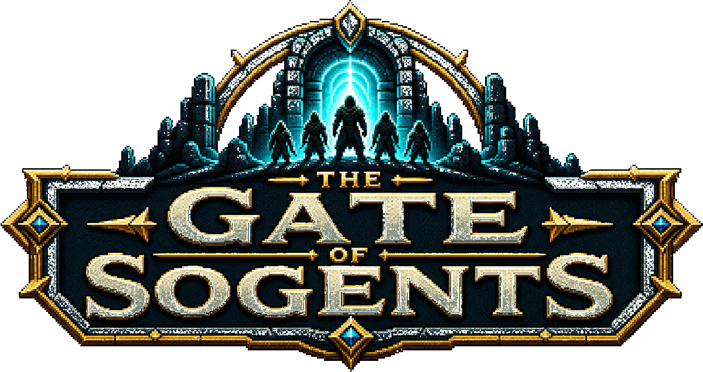

<p align="center">
  
</p>

# The Gate of Sogents

The Gate of Sogents is an on-chain RPG prototype built for Somnia.

Players recruit heroes who are generated from live market data fetched through Somnia Agents. Each hero gets a unique seed, class, rarity, and traits such as bravery, greed, and wisdom.

The game idea is simple:

```text
Recruit hero
-> Somnia Agent fetches live market data
-> Contract generates unique hero traits
-> Send heroes into a simple on-chain gate run
-> LLM Agent returns a route and story
-> Contract resolves floors for HP, loot, retreat, or defeat
```

Current prototype uses Somnia's JSON API Agent to fetch:

```text
BTC/USD
ETH/USD
SOMI/USD
```

Those values are combined on-chain to create a unique hero.

## Current Scope

The current version focuses on hero generation, LLM-narrated gate runs, timed forge orders, and arena weapon NFTs.

Contract version:

```text
0.6.0-forge-nfts
```

Current Somnia Testnet deployment:

```text
0xEA7bc83F5b52BA4685dEf6d29D748DC10c0b9E69
```

Included:

- Somnia Agents integration
- Market-data-based hero generation
- Hero seed
- Class
- Rarity
- Bravery
- Greed
- Wisdom
- Pixel-art frontend simulation
- Generated class portraits
- Walkable/clickable RPG camp
- NPC dialogue and interaction actions
- Mobile movement controls
- In-world labels and action feedback
- On-chain gate run start/resolve
- Somnia LLM Inference route + story generation
- Banked shard tracking
- Timed forge orders
- ERC721 weapon NFTs
- Manual weapon equip for arena fights
- Live event log

## Contract Testing

Foundry config and tests are included so contract logic can be tested without Remix.

Fast local tests mock the Somnia Agents platform contract at the real testnet address:

```text
SomniaAgents: 0x037Bb9C718F3f7fe5eCBDB0b600D607b52706776
AgentRegistry: 0x08D1Fc808f1983d2Ea7B63a28ECD4d8C885Cd02A
JSON API Agent ID: 13174292974160097713
LLM Inference Agent ID: 12847293847561029384
```

For repeated local testing, start the reusable Foundry container once:

```bash
./tools/foundry-dev.sh start
./tools/foundry-dev.sh test -vvv
```

This uses the local `node:20.19-bookworm` Docker image, keeps one `gates-foundry-dev` container running, installs pinned Foundry npm packages once inside it, and runs later `forge` / `cast` commands through `docker exec`.

Stop it when done:

```bash
./tools/foundry-dev.sh stop
```

For a fully fresh throwaway container, use:

```bash
./tools/foundry-docker.sh
```

The throwaway script copies the repo into `/tmp` inside a new container, installs the same pinned Foundry npm packages there, runs `forge`, and deletes the container after exit.

The pinned npm packages are:

```text
@foundry-rs/forge@1.7.1
@foundry-rs/anvil@1.7.1
@foundry-rs/cast@1.7.1
```

Run against a Somnia fork in Docker:

```bash
SOMNIA_RPC_URL=https://dream-rpc.somnia.network/
./tools/foundry-dev.sh test --fork-url $SOMNIA_RPC_URL
```

Deploy to Somnia Testnet:

```bash
cp .env.example .env
# fill PRIVATE_KEY in .env
source .env
./tools/foundry-dev.sh forge script script/DeployGatesOfSogentMarketGame.s.sol \
  --rpc-url $SOMNIA_RPC_URL \
  --broadcast \
  --legacy \
  --gas-estimate-multiplier 2000
```

Somnia deployment gas is higher than Foundry estimates for this contract. The LLM-enabled deployment used a high gas estimate multiplier so the broadcast transaction had enough gas.

Request a live Somnia Agent hero generation:

```bash
source .env
./tools/foundry-dev.sh cast call $GAME_ADDRESS "requiredTotalFee()(uint256)" --rpc-url $SOMNIA_RPC_URL
./tools/foundry-dev.sh cast-send-private $GAME_ADDRESS "requestHero(string)" "$HERO_NAME" \
  --value 360000000000000000 \
  --rpc-url $SOMNIA_RPC_URL \
  --legacy \
  --gas-limit 12000000
```

The `--value` above is the current testnet fee returned by `requiredTotalFee()`. If the call returns a different first integer later, use that value.

Start a live LLM gate adventure for hero `1`:

```bash
source .env
./tools/foundry-dev.sh cast call $GAME_ADDRESS "requiredGateDecisionFee()(uint256)" --rpc-url $SOMNIA_RPC_URL
./tools/foundry-dev.sh cast-send-private $GAME_ADDRESS "startAdventure(uint256)" 1 \
  --value 240000000000000000 \
  --rpc-url $SOMNIA_RPC_URL \
  --legacy \
  --gas-limit 12000000
```

The `--value` above is the current testnet fee returned by `requiredGateDecisionFee()`. If the call returns a different first integer later, use that value.

Local tests are instant because the agent callback is mocked. Live Somnia Testnet requests are still asynchronous because validators must fetch the market data and call the contract back.

The LLM gate flow is also asynchronous. The LLM returns a route such as `PPS` plus a short story. The contract trusts only the route, then resolves combat, HP, loot, retreat, and defeat on-chain.

## Frontend

Run a local static server:

```bash
python3 -m http.server 4173
```

Then open:

```text
http://127.0.0.1:4173/index.html
```

The frontend starts at a wallet gate. After connecting, the player enters the PixiJS camp and uses NPCs for the main actions: Recruiter for hero creation, Guildmaster for roster selection, Gate Warden for adventures, Blacksmith for forge orders and weapons, Arena Master for challenges, and Chronicle for logs.

The deployed `GatesOfSogentMarketGame` address is configured in `src/config.js`. In Somnia mode, hero recruitment calls `requestHero(name)`, shows the pending Somnia Agent request in the Chronicle, and waits for the contract `HeroGenerated` event. Market values are used for the hero seed but are hidden from the player UI.

The frontend checks `contractVersion()`, `supportsGateRuns()`, `supportsForge()`, and `supportsWeaponNFTs()` when connecting, so deploy the latest contract in this repo before using the Gate Warden or Blacksmith on-chain.

The current contract covers hero generation, simple gate runs, banked shards, timed forge orders, ERC721 weapon minting, NFT transfer, and manual weapon equip for arena fights.

PixiJS is loaded from CDN and pinned to `8.18.1`. ethers is loaded from CDN and pinned to `6.16.0`. No npm install is required.

Planned later:

- Deeper combat
- Full loot inventory contracts
- NFT heroes
- In-game weapon sale listings
